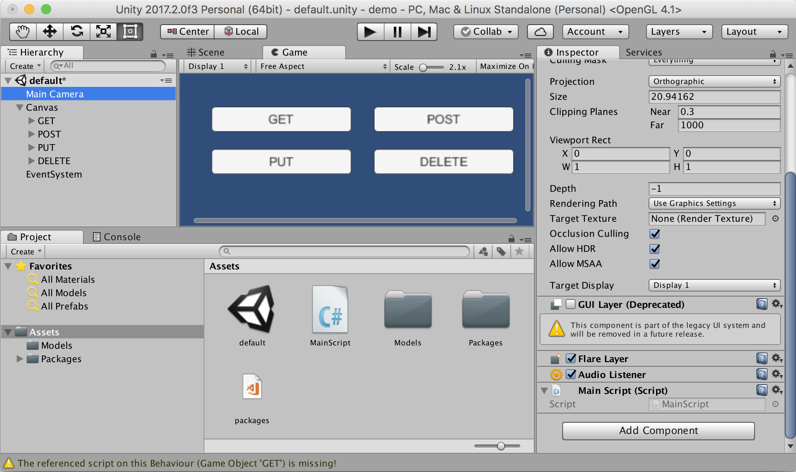
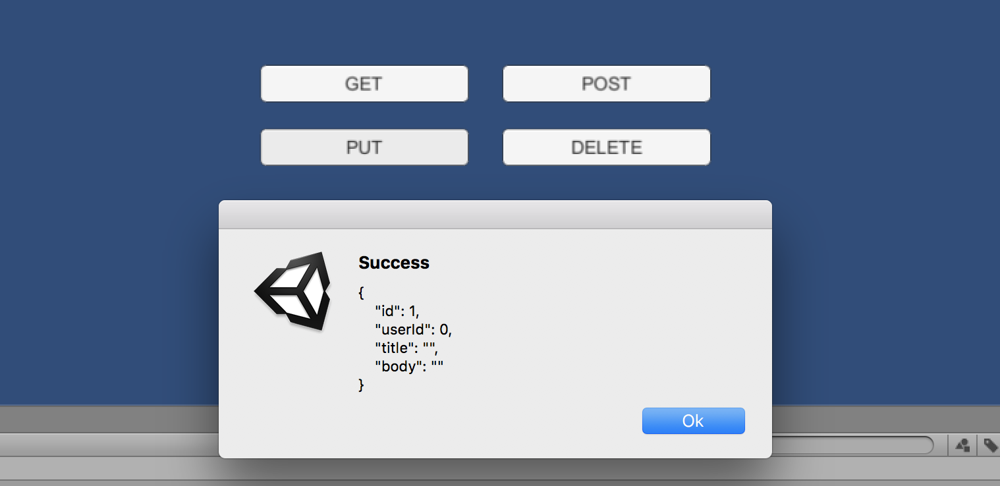

# RestClient for Unity 🤘


This **HTTP/REST** Client is based on Promises to avoid the [Callback Hell](http://callbackhell.com/) ☠️ and the [Pyramid of doom](https://en.wikipedia.org/wiki/Pyramid_of_doom_(programming)) 💩 working with **Coroutines** in **Unity** 🎮, example:

```csharp
var api = "https://jsonplaceholder.typicode.com";
RestClient.GetArray<Post>(api + "/posts", (err, res) => {
  RestClient.GetArray<Todo>(api + "/todos", (errTodos, resTodos) => {
    RestClient.GetArray<User>(api + "/users", (errUsers, resUsers) => {
      if(err != null){
        EditorUtility.DisplayDialog ("Error", errTodos.Message, "Ok");
      }
    });
  });
});
```

But working with **Promises** we can improve our code, yay! 👏

```csharp
RestClient.GetArray<Post>(api + "/posts").Then(response => {
  EditorUtility.DisplayDialog ("Success", JsonHelper.ArrayToJson<Post>(response, true), "Ok");
  return RestClient.GetArray<Todo>(api + "/todos");
}).Then(response => {
  EditorUtility.DisplayDialog ("Success", JsonHelper.ArrayToJson<Todo>(response, true), "Ok");
  return RestClient.GetArray<User>(api + "/users");
}).Then(response => {
  EditorUtility.DisplayDialog ("Success", JsonHelper.ArrayToJson<User>(response, true), "Ok");
}).Catch(err => EditorUtility.DisplayDialog ("Error", err.Message, "Ok"));
```

## Demo ⏯
Do you want to see this beautiful package in action? Download the demo [here](https://minhaskamal.github.io/DownGit/#/home?url=https://github.com/proyecto26/RestClient/tree/master/demo)
> Restore the nuget packages using **Visual Studio** or executing the following command from the terminal/command line: **nuget restore Assets/packages.config**




## Installation 👨‍💻
### Nuget package
Download this package from **NuGet** with **Visual Studio** creating a **[NuGet.config](https://github.com/proyecto26/RestClient/blob/master/demo/NuGet.config)** file at the root of your **Unity Project**, for example:

```xml
<?xml version="1.0" encoding="utf-8"?>
<configuration>
  <config>
    <add key="repositoryPath" value="./Assets/Packages" />
  </config>
</configuration>
```
The package to search for is **[Proyecto26.RestClient](https://www.nuget.org/packages/Proyecto26.RestClient/)**.

## Getting Started 📚
The default methods **(GET, POST, PUT, DELETE)** are:
```
RestClient.Get("https://jsonplaceholder.typicode.com/posts/1").Then(response => {
  EditorUtility.DisplayDialog("Response", response.text, "Ok");
})

RestClient.Post("https://jsonplaceholder.typicode.com/posts", newPost).Then(response => {
  EditorUtility.DisplayDialog("Status", response.statusCode.ToString(), "Ok");
})

RestClient.Put("https://jsonplaceholder.typicode.com/posts/1", updatedPost).Then(response => {
  EditorUtility.DisplayDialog("Status", response.statusCode.ToString(), "Ok");
})

RestClient.Delete("https://jsonplaceholder.typicode.com/posts/1").Then(response => {
  EditorUtility.DisplayDialog("Status", response.statusCode.ToString(), "Ok");
})
```

But we are going to create a class **"User"** and the HTTP requests to load **JSON** data easily:
```
[Serializable]
public class User
{
  public int id;
  public string name;
  public string username;
  public string email;
  public string phone;
  public string website;
}
```

* **GET JSON**
```
var usersRoute = "https://jsonplaceholder.typicode.com/users"; 
RestClient.Get<User>(usersRoute + "/1").Then(firstUser => {
  EditorUtility.DisplayDialog("JSON", JsonUtility.ToJson(firstUser, true), "Ok");
})
```
* **GET Array**
```
RestClient.GetArray<User>(usersRoute).Then(allUsers => {
  EditorUtility.DisplayDialog("JSON Array", JsonHelper.ArrayToJsonString<User>(allUsers, true), "Ok");
})
```
Also we can create different classes for custom responses:
```
[Serializable]
public class CustomResponse
{
  public int id;
}
```
* **POST**
```
RestClient.Post<CustomResponse>(usersRoute, newUser).Then(customResponse => {
  EditorUtility.DisplayDialog("JSON", JsonUtility.ToJson(customResponse, true), "Ok");
})
```
* **PUT**
```
RestClient.Put<CustomResponse>(usersRoute + "/1", updatedUser).Then(customResponse => {
  EditorUtility.DisplayDialog("JSON", JsonUtility.ToJson(customResponse, true), "Ok");
})
```

## Custom HTTP Headers and Options 💥
**HTTP Headers**, such as `Authorization`, can be set in the **DefaultRequestHeaders** object for all requests
```
RestClient.DefaultRequestHeaders["Authorization"] = "Bearer ...";
```

Also we can add specific options and override default headers for a request
```
var requestOptions = new RequestHelper { 
  url = "https://jsonplaceholder.typicode.com/photos",
  headers = new Dictionary<string, string>{
    { "Authorization", "Other token..." }
  }
};
RestClient.GetArray<Photo>(requestOptions).Then(response => {
  EditorUtility.DisplayDialog("Header", requestOptions.GetHeader("Authorization"), "Ok");
})
```

And later we can clean the default headers for all requests
```
RestClient.CleanDefaultHeaders();
```

## Collaborators 🥇
[](https://github.com/jdnichollsc) | [](https://github.com/diegoossa) |
:---: | :---: |
[Juan Nicholls](mailto:jdnichollsc@hotmail.com) | [Diego Ossa](mailto:diegoossa@gmail.com) |

## Credits 👍
* [Real Serious Games/C-Sharp-Promise](https://github.com/Real-Serious-Games/C-Sharp-Promise)

## Supporting 🍻
I believe in Unicorns 🦄
Support [me](http://www.paypal.me/jdnichollsc/2), if you do too.

## Happy coding 💯
Made with ❤️


